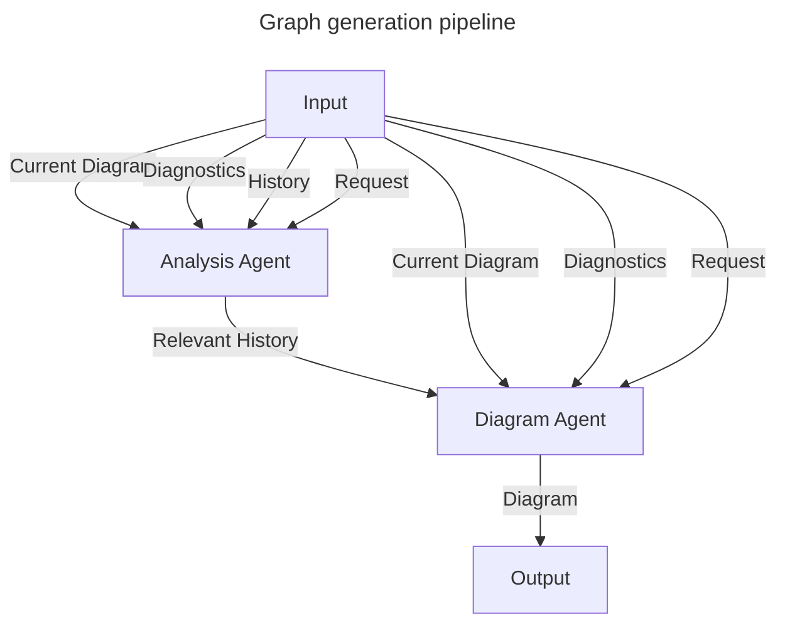
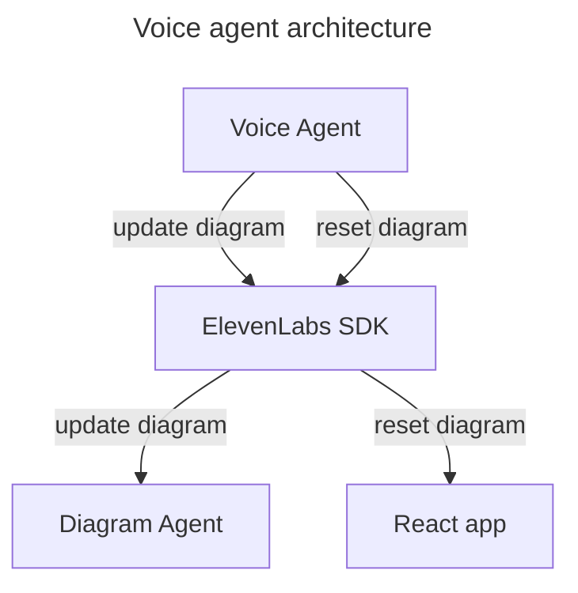

# Diagram It!

http://localhost:5173/#32c16ee8-132a-47c8-87c6-2b6cb0d67e34

```mermaid
---
title: Graph generation pipeline
---

flowchart TD
    Input -->|Current Diagram| AnalysisAgent
    Input -->|Diagnostics| AnalysisAgent
    Input -->|History| AnalysisAgent
    Input -->|Request| AnalysisAgent
    AnalysisAgent[Analysis Agent] -->|Relevant History| DiagramAgent
    Input -->|Current Diagram| DiagramAgent
    Input -->|Diagnostics| DiagramAgent
    Input -->|Request| DiagramAgent
    DiagramAgent[Diagram Agent] -->|Diagram| Output
```

http://localhost:5173/#384e767c-a8ec-40c3-a00f-8deabf689142

```mermaid
---
title: Voice agent architecture
---

flowchart TD
    Voice[Voice Agent] -->|update diagram| 11SDK[ElevenLabs SDK]
    Voice[Voice Agent] -->|reset diagram| 11SDK
    11SDK -->|update diagram| DiagramAgent[Diagram Agent]
    11SDK -->|reset diagram| React[React app]

```
