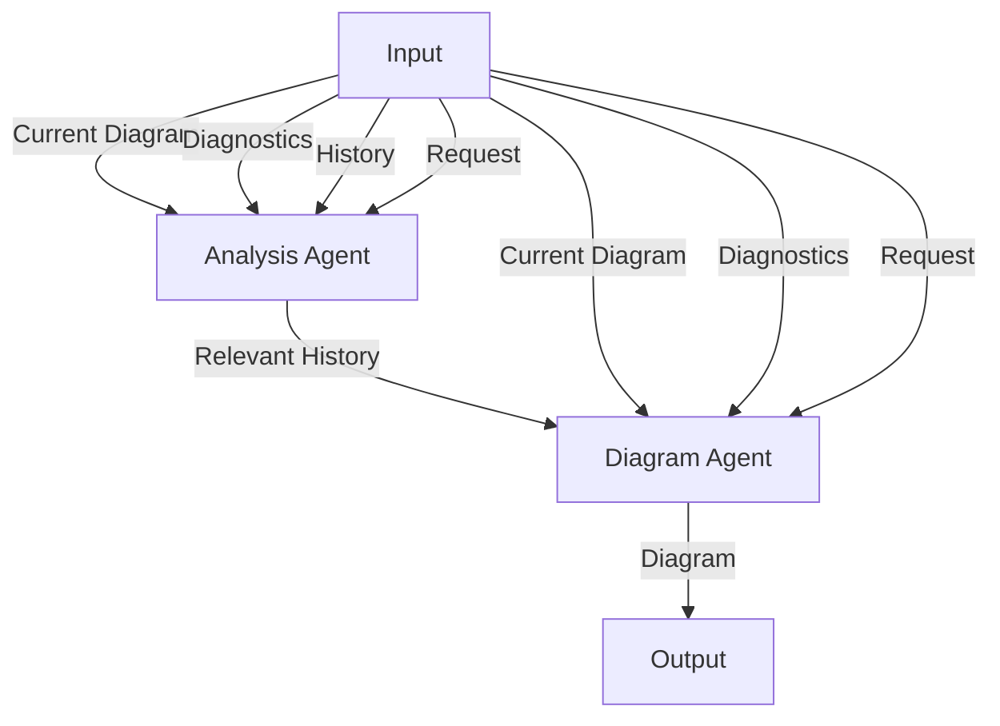

# Diagram It!

```mermaid
flowchart TD
    Input -->|Current Diagram| AnalysisAgent
    Input -->|Diagnostics| AnalysisAgent
    Input -->|History| AnalysisAgent
    Input -->|Request| AnalysisAgent
    AnalysisAgent[Analysis Agent] -->|Relevant History| DiagramAgent
    Input -->|Current Diagram| DiagramAgent
    Input -->|Diagnostics| DiagramAgent
    Input -->|Request| DiagramAgent
    DiagramAgent[Diagram Agent] -->|Diagram| Output

```
